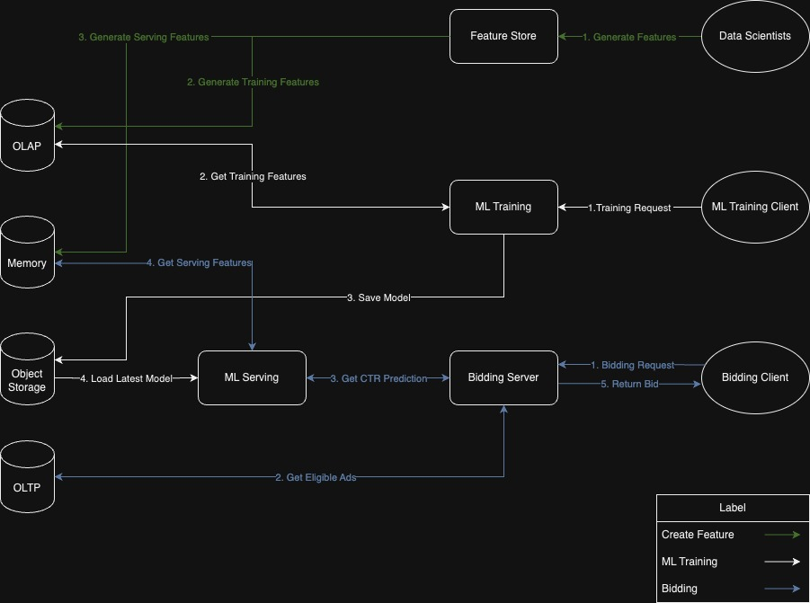

# Mini Demand-Side Platform

This is a compact [demand-side platform](https://en.wikipedia.org/wiki/Demand-side_platform) (DSP) operating on a Kubernetes cluster, accompanied by a custom [feature store](https://www.featurestore.org/what-is-a-feature-store#:~:text=The%20Feature%20Store%20is%20where,that%20have%20a%20trained%20model).) service. The platform incorporates a machine learning module capable of making click-through-rate (CTR) predictions using historical data. Additionally, it utilizes a straightforward bidding logic to determine the most suitable ad among all the available options. For more information on demand-side platforms.

## Modules
- [Feature store](https://github.com/mini-demand-side-platform/feature-store)
- [Machine Learning Training](https://github.com/mini-demand-side-platform/ml-training)
- [Machine Learning Serving](https://github.com/mini-demand-side-platform/ml-serving)
- [Bidding Server](https://github.com/mini-demand-side-platform/bidding-server)
- [Modeling Notebooks](https://github.com/mini-demand-side-platform/research)
- [Databases](https://github.com/mini-demand-side-platform/databases)
## Technical Stack
- Custom Feature Store
- Api: Fastapi
- Container: Kubernetes, Docker, Docker-compose
- ML modeling: scikit-learn
- ML model serving: Fastapi
- ML model storage: Minio
- OLTP: postgres
- OLAP: postgres

## Usages
#### 1. Train a new model
Training a new model with folling command. The new model will immediately replace the old one.
```bash
curl -X 'POST' \
  'http://localhost:8001/model_training' \
  -H 'accept: application/json' \
  -H 'Content-Type: application/json' \
  -d '{
    "feature_table_name": "top_10_features",
    "label_table_name": "ctr",
    "label_column_name": "was_click"
  }'
```
#### 2. Make Bid
Sending the bid request to the bidding server. It will return the most suitable ad in the database and the decided price.

```bash
curl -X 'POST' \
  'http://localhost:8003/bw_dsp' \
  -H 'accept: application/json' \
  -H 'Content-Type: application/json' \
  -d '{
  "bid_floor": 0,
  "height": 0,
  "width": 0,
  "hist_ctr": 0,
  "hist_cvr": 0
}'
``` 

#### Optional. Feature Store
You can create feature store on `localhost:8000`.

See this swagger UI for detail. 
```
http://localhost:8000/docs
```

See the [mini-demand-side-platform/research](https://github.com/mini-demand-side-platform/research) for example.
## Requirments
- Docker 
- Docker-compose 
- minikube(Docker)
- make

## Setup

#### 1. Active databases
```bash
git clone git@github.com:mini-demand-side-platform/databases.git
cd databases 
make run-all-with-example-data
```

#### 2. Start minikube
```bash
minikube start --cpus 4 --network mini-demand-side-platform --memory 4096 
```
Sometime, minikube might create the server on the used `static-ip`. It will cause an error. Therefore, if it happens, you can try to specify a `static-ip` to avoid it. 

Use this command line to check the ip be used.
```bash
docker inspect -f '{{.Name}} - {{range .NetworkSettings.Networks}}{{.IPAddress}}{{end}}' $(docker ps -aq)
```

Run the minikube with specific `static-ip`
```bash
minikube start --cpus 4 --network mini-demand-side-platform --memory 4096 --static-ip <static-ip>
```

#### 3. Start minikube tunnel for loadBalancer
```bash
minikube tunnel
```

#### 4. Deploy all the service
```bash
make deploy-all
```

#### 5. Close up
Kill all the service.
```bash
make kill-all
```

Delete minikube cluster.
```bash
minikube delete
```